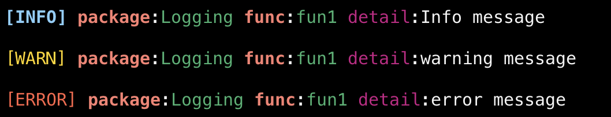

# jlog

## Installation
```bash
go get github.com/pandamy619/logger
```

## Usage

### func InitLog

```go
func InitJLog(pkg string, location string, consoleLog string) *Logs
```
Create new Logger.
* pkg: Name package.
* location: Folder where logs will be saved.
* consoleLog: Method output to console, simple or json.

### func Log

```go
func Log(name string) *Logs
```
Usually called at the beginning of a function.
* name: Function name.

### func Sublog

```go
func SubLog(status string, message string, time string) *Logs
```
* status: Status log (info/warning/error/customStatus).
* message: Message containing information about the log.
* time: Date and time.

### func SubLogWithFields
```go
func SubLogWithFields(status string, message string, time string, field Fields) *Logs
```
* status: Status log (info/warning/error/customStatus).
* message: Message containing information about the log.
* time: Date and time.
* fields: Fields.

## Example

```go
package main
import (
    "time"

    "logging"
)

func fun1(l *Logs) {
   l.Log("fun1").SubLog(
   	   "info",
       "some message",
       time.Now().Format("2006-01-02T15:04:05"),
   ).Info("some info message")
}

func fun2(l *Logs) {
   ls := l.Log("fun2")
   ls.SubLog(
       "warning",
       "some message",
       time.Now().Format("2006-01-02T15:04:05"),
   ).Warning("some warning message")
}

func fun3(l *Logs) {
    ls := l.Log("fun3")
    ls.SubLog(
       "error",
       "some message",
       time.Now().Format("2006-01-02T15:04:05"),
    ).Error("some error message")
}

func main() {
   l := logging.InitLog("SomePackage", "tmp", "simple")
   fun1(l)
   fun2(l)
   fun3(l)
}
```

simple log


